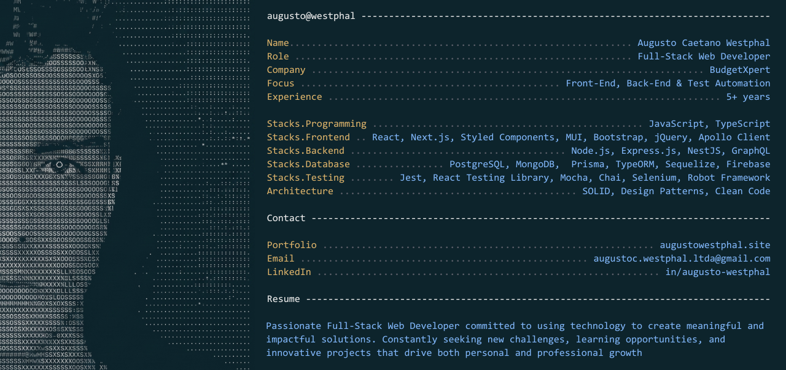

<div align="center">



</div>

## $ open contact/

<p>

<a href="https://augustowestphal.site">

</a>

<a href="https://www.linkedin.com/in/augusto-westphal/">

</a>

<a href="https://github.com/AugustoGitH">

</a>

</p>

---

> Generated automatically by GitHub Actions.

<p align="center">


</p>

---

## $ tree ./tech-stack

### Front-End


### Back-End


### Databases & ORM


### Testing


### Architecture


---

<div align="center">

```text
$ exit

Session closed.

Thanks for visiting.
```

</div>
