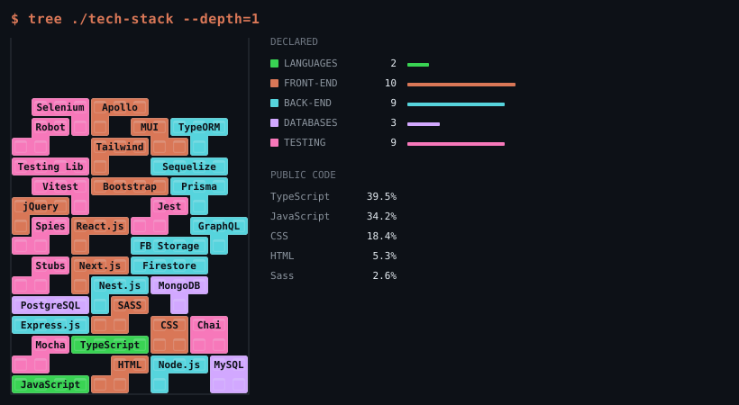
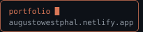
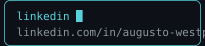
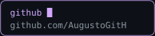
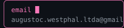

<!-- ══════════════════ 00 · BLOG ══════════════════ -->
<!-- assets/about-blog.svg: node scripts/render_about.mjs
     a montagem em caracteres vem de data/ascii-frames.json (prep_ascii.py) -->

  

 
 

<!-- ══════════════════ 01 · APRESENTAÇÃO ══════════════════ -->

  

 
 

<!-- ══════════════════ 02 · COMMITS ══════════════════ -->

  

 
 

<!-- ══════════════════ 03 · STACKS ══════════════════ -->

  

 
 

<!-- ══════════════════ 04 · LINKS ══════════════════ -->

<!-- sem espaço entre as tags: o branco entre  inline viraria medianiz
     do navegador e a fileira não fecharia nos 820 do terminal abaixo -->

 
 

  

